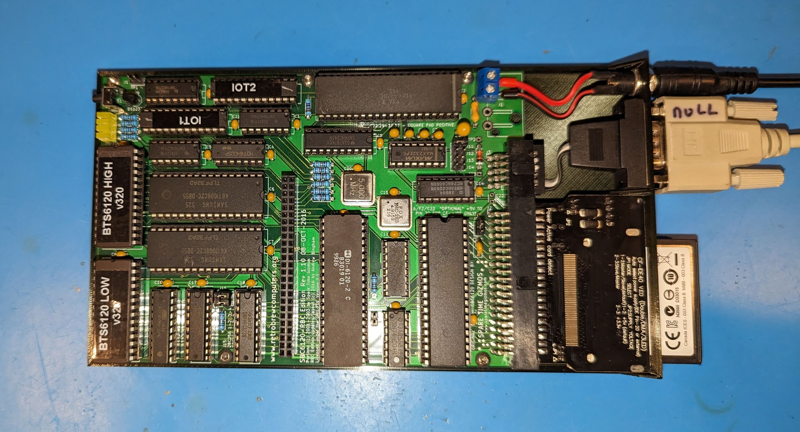

This is a simple 3D printable mounting plate for the [SBC6120 Retro Brew Computing](https://www.retrobrewcomputers.org/doku.php?id=boards:sbc:sbc6120-rbc-edition:start) (or RBC) edition "PDP8 on a chip" single board computer.

There are two different versions since the commonly availabe CF adapters from China look similar, but are slightly different dimensions.  Pick the STL file that matches the CF adapter you are using.

For the DC jack I used a DC-025M model, but any DC power jack that fits in a 8mm hole should work. Secure the board to the plate with M3 x 4mm screws.

